# Project_template

Тип: Материал
Родитель: Описание проекта для 11 когорты (https://www.notion.so/11-03abbbbc8bcb49ed9b85c9b6d1174056?pvs=21)

Это шаблон для решения проектной работы. Структура этого файла повторяет структуру заданий. Заполняйте его по мере работы над решением.

# Задание 1. Анализ и планирование

### 1. Описание функциональности монолитного приложения

**Управление отоплением:**

Пользователи могут удалённо включать/выключать отопление в своих домах и установить необходимую температуру.

**Мониторинг температуры:**

Система получает данные о температуре с датчиков, установленных в домах. Пользователи могут просматривать текущую температуру в своих домах через веб-интерфейс.

### 2. Анализ архитектуры монолитного приложения

Язык программирования: Java

База данных: PostgreSQL

Архитектура: монолит

### 3. Определение доменов и границы контекстов

1. Управление отоплением.
2. Мониторинг температуры

### **4. Проблемы монолитного решения**

- Нет возможности подключать датчики из приложения, требуется вмешательство специалиста.
- Данные о температуре получаем с помощью синхронных запросов -> при большом количество устройств будет высокая нагрузка на сервер
- Нет возможности нормально масштабировать систему
- Мы не можем отдельно работать над логикой обработки данных с датчиков без перезапуска всей системы
- Ошибка в одной части системы повлечет за собой сбой всей системы
- Нет обработки отказов,если модуль перестал отвечать
- Как будто система спроектирована так, что работает с одним пользователем, нет разграничения доступа к устройствам

### 5. Визуализация контекста системы — диаграмма С4

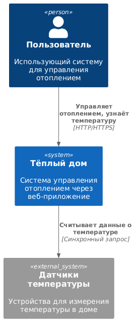

# Задание 2. Проектирование микросервисной архитектуры

В этом задании вам нужно предоставить только диаграммы в модели C4. Мы не просим вас отдельно описывать получившиеся микросервисы и то, как вы определили взаимодействия между компонентами To-Be системы. Если вы правильно подготовите диаграммы C4, они и так это покажут.

**Диаграмма контейнеров (Containers)**

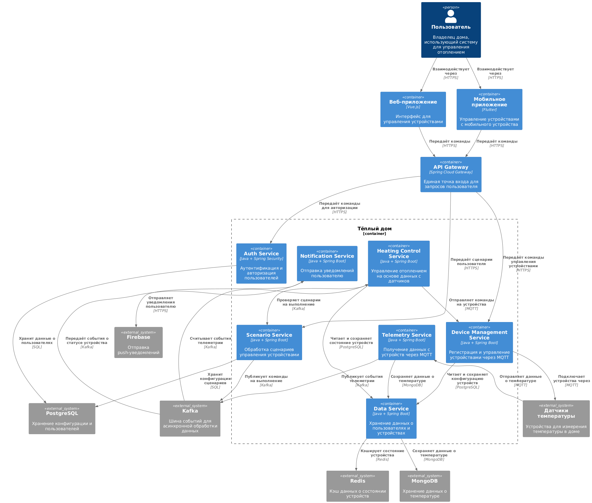

**Диаграмма компонентов (Components)**

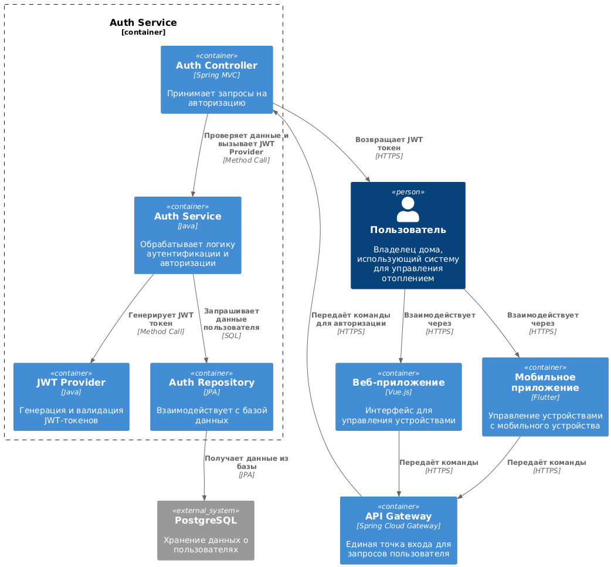
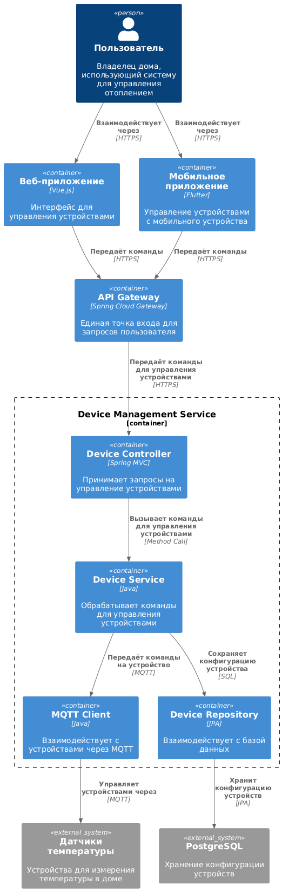
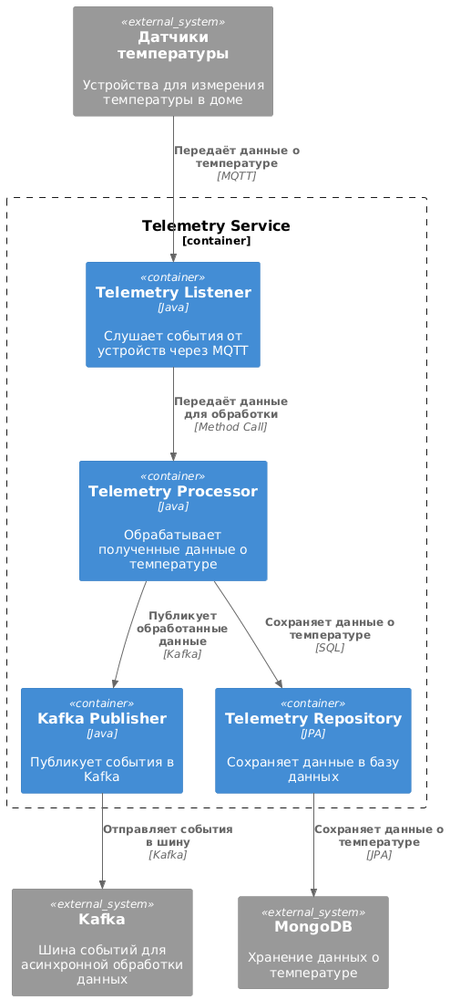
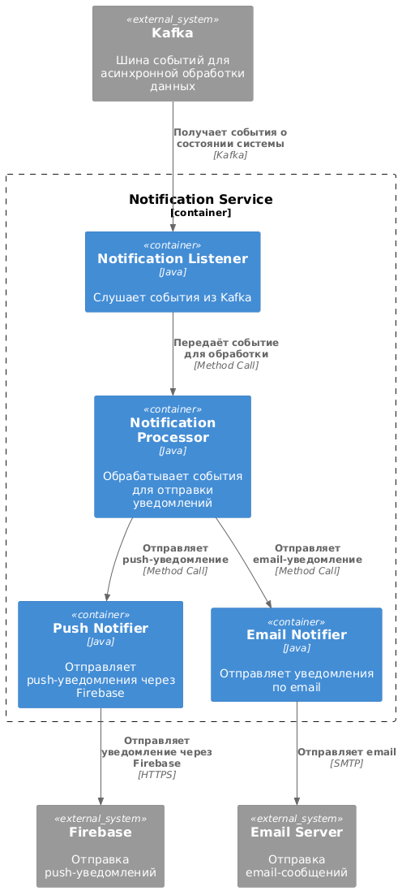
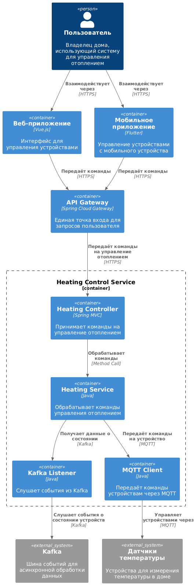
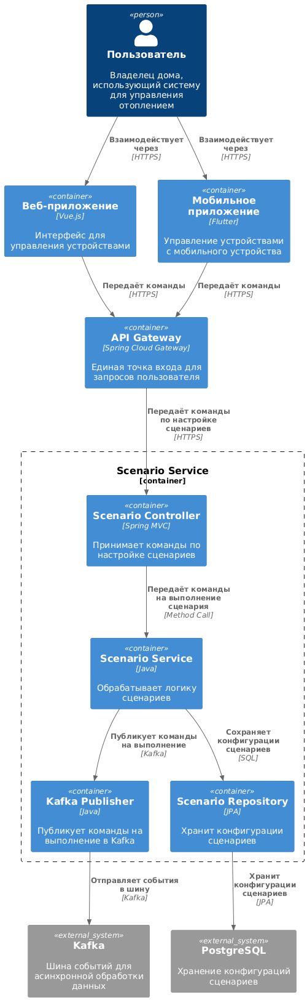
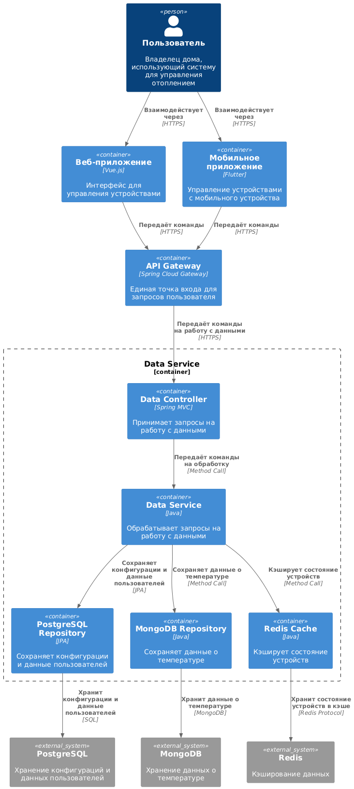

**Диаграмма кода (Code)**

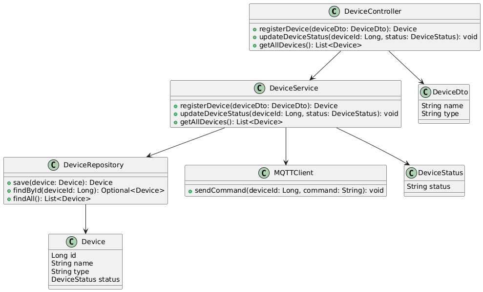

# Задание 3. Разработка ER-диаграммы

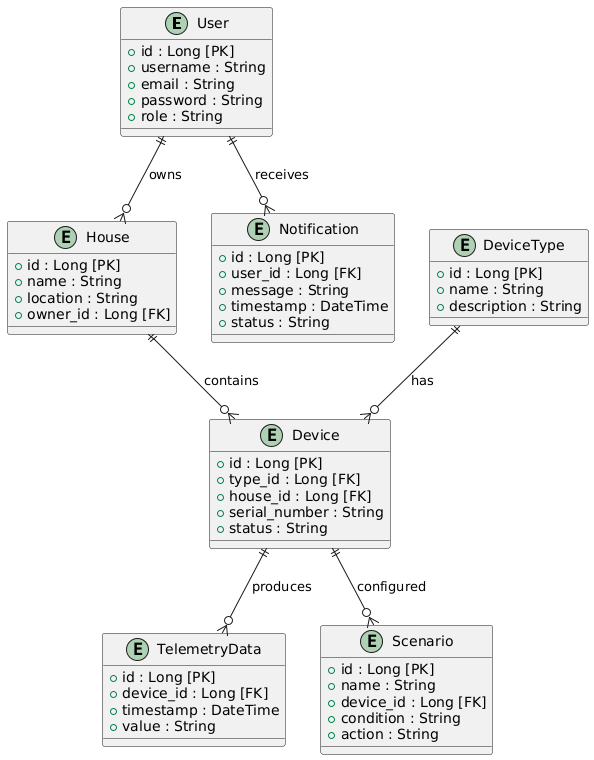

# ❌  Задание 4. Создание и документирование API

### 1. Тип API

Укажите, какой тип API вы будете использовать для взаимодействия микросервисов. Объясните своё решение.

### 2. Документация API

Здесь приложите ссылки на документацию API для микросервисов, которые вы спроектировали в первой части проектной работы. Для документирования используйте Swagger/OpenAPI или AsyncAPI.